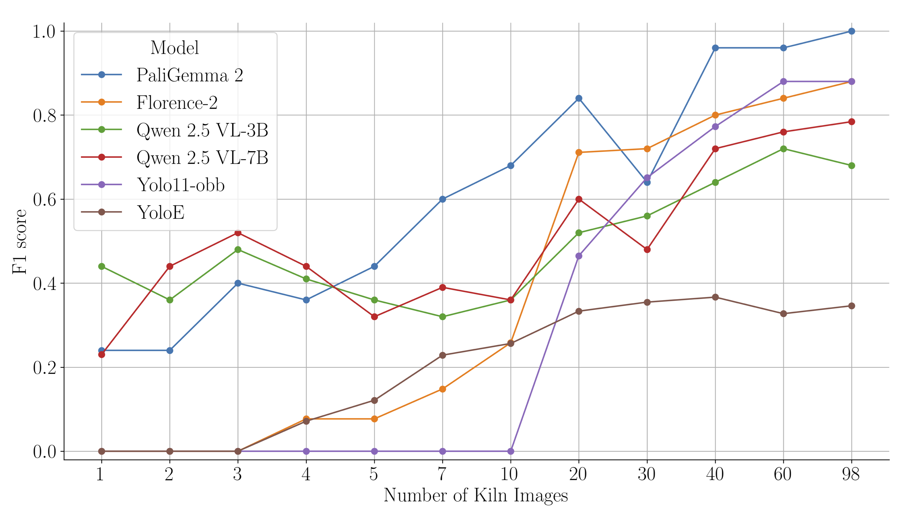
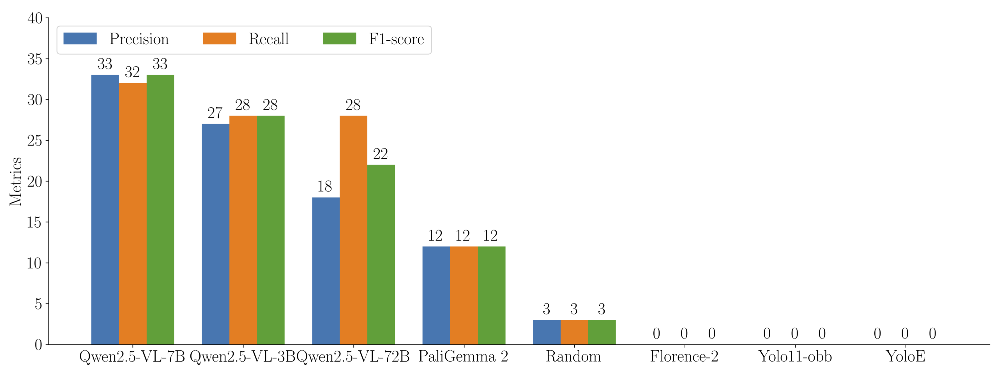
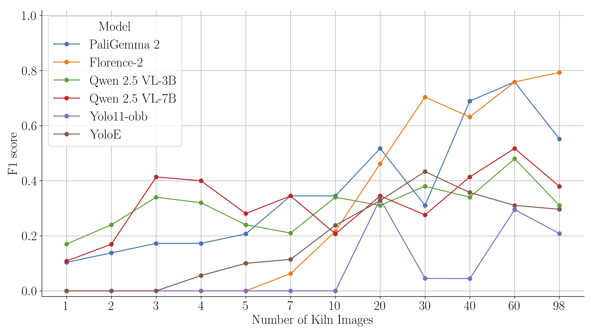

# Exploration of Vision Language Models for Brick Kilns Detection from Satellite Imagery

> ### A Note on Reproducibility and Usage
>
> This repository serves as a **reference implementation** and a detailed showcase of the methodology presented in the Master's thesis by Shataxi Dubey. The code has been refactored and organized from the original experimental Jupyter notebooks for clarity and to present a clean project structure.
>
> **This is not a 'plug-and-play' solution.** You should expect to adapt the code to your own environment and data. Specifically:
>
> *   **Data is Not Included:** The satellite imagery and corresponding labels used in the research are not part of this repository. All file paths in the configuration files (`configs/`) are placeholders and must be updated.
> *   **Environment Sensitivity:** Fine-tuning large models is highly dependent on the specific hardware (GPU type), CUDA version, and library versions. The included `requirements.txt` provides a snapshot of the environment used, but you may need to resolve dependency conflicts for your specific setup.
> *   **Conceptual Data Scripts:** The data processing scripts in `src/data/` are provided to illustrate the required data transformation pipeline (e.g., converting YOLO-OBB to COCO). They will require your specific data to be fully functional.
>
> Think of this repository as a **blueprint for the research**, designed to be clear, understandable, and adaptable, rather than a production-ready application.

---

**Read the full story on our [Blog Post](link-to-your-blog-post.com)!**

### Abstract

Vision-Language Models (VLMs) have emerged as powerful tools capable of performing various tasks, including image captioning, visual question answering, and object detection with natural language prompts. This work focuses on applying VLMs to the environmental monitoring of brick kilns, a significant source of air pollution in India. To effectively monitor brick kilns, it is necessary to localize them via object detection. While prior work has relied on traditional object detection models, we investigate the potential of VLMs. Our study finds that VLMs struggle with zero-shot detection of kilns but, when fine-tuned with only a few examples, significantly outperform a strong baseline (YOLOv11-obb). Furthermore, VLMs demonstrate reduced spatial bias and better generalization across different geographical regions. These findings encourage the application of VLMs to remote sensing, particularly when minimal supervision is available.

---

### Key Finding: Data-Efficient Fine-Tuning

The central finding of this research is that Vision-Language Models can achieve superior performance with significantly less training data compared to specialized object detectors like YOLO.


_Comparison of F1-score on Lucknow Region: Fine-tuned VLMs vs. YOLOv11-obb. Models were fine-tuned on the training set from the Lucknow region and evaluated on its test set to measure F1-score._

---

### Problem Statement

Brick kilns are a major contributor to air pollution, accounting for an estimated 8-14% of harmful particulate matter emissions in India. Effective environmental regulation requires accurate, large-scale monitoring of these kilns. However, traditional methods like ground surveys are time-consuming, expensive, and not scalable.

While satellite imagery offers a scalable alternative, automated detection faces two key challenges:
1.  **Data Scarcity:** Labeled satellite imagery for niche objects like brick kilns is rare.
2.  **Poor Generalization:** Models trained on data from one geographical region often fail to perform well in another due to variations in terrain, lighting, and kiln appearance.

### Our Approach

This project tackles these challenges by leveraging modern Vision-Language Models (VLMs). We compare two primary approaches:

1.  **Traditional Object Detection:** Using a state-of-the-art **YOLOv11-obb** model as a strong baseline.
2.  **Vision-Language Models:** Evaluating several prominent VLMs, including **Florence-2**, **PaliGemma 2**, and **Qwen2.5-VL**, in both zero-shot and fine-tuned settings.

Our methodology explores model performance in terms of data efficiency, generalization across different regions (Lucknow vs. West Bengal), and robustness to background noise.

### Handling Large Imagery: Tiled Inference

A known limitation of many Vision-Language Models is their fixed input resolution. To apply our models to large, high-resolution satellite images, we implemented a **tiled inference** strategy using the [SAHI (Slicing Aided Hyper Inference)](https://github.com/obss/sahi) library.

The process involves:
1.  Slicing a large input image into smaller, overlapping patches.
2.  Running the fine-tuned VLM on each individual patch.
3.  Stitching the results back together and using Non-Maximum Suppression (NMS) to merge duplicate detections in the overlapping regions.

While this technique proved effective, it significantly increases the computational cost of inference, as a single image is processed as hundreds of smaller ones. Due to this time constraint, this method was used as a proof-of-concept rather than for exhaustive evaluation across all experiments. The implementation can be found in `src/inference/tiled_inference.py`.

### Data Curation: From Planet to Google Maps

A critical part of this work was curating a high-resolution dataset suitable for VLM analysis. The initial Planet imagery, with a resolution of 4.77 meters, was insufficient for reliably identifying the distinct features of brick kilns.

To overcome this, we developed a pipeline to create a high-resolution dataset using Google Maps Satellite (GMS) imagery. We used the geocoordinates from the low-resolution Planet tiles to fetch corresponding high-resolution (~0.5m) GMS imagery. This process was automated using the `leafmap` library.

Below is an illustrative code snippet of this data curation process, as implemented in `src/data/data_curation.py`:

```python
import leafmap
import geopandas as gpd

def get_high_res_imagery(geojson_path, output_dir, zoom_level=18):
    """
    Fetches high-resolution Google Maps Satellite imagery for each
    geometry in a GeoJSON file.

    Args:
        geojson_path (str): Path to the GeoJSON file containing tile geometries.
        output_dir (str): Directory to save the downloaded images.
        zoom_level (int): The zoom level for Google Maps tiles.
    """
    gdf = gpd.read_file(geojson_path)
    gdf = gdf.to_crs("EPSG:4326") # Ensure WGS 84 for bounding boxes

    for index, row in gdf.iterrows():
        # Get the bounding box for the tile
        bounds = row['geometry'].bounds
        bbox = [bounds[0], bounds[1], bounds[2], bounds[3]] # [minx, miny, maxx, maxy]

        # Define output path
        image_name = f"{row['x']}_{row['y']}.tif"
        output_path = os.path.join(output_dir, image_name)

        if not os.path.exists(output_path):
            print(f"Downloading tile: {image_name}")
            leafmap.map_tiles_to_geotiff(
                output_path,
                bbox,
                zoom=zoom_level,
                source='Google Satellite'
            )
        else:
            print(f"Skipping existing tile: {image_name}")

# Example Usage:
# get_high_res_imagery('path/to/planet_metadata.geojson', 'data/gms_imagery/')
```

### Repository Structure

```
├── configs/                  # YAML configs for fine-tuning experiments
├── scripts/                  # User-facing scripts to run pipelines
├── src/                      # Core source code
│   ├── data/                 # Data curation and processing logic
│   ├── finetuning/           # Model-specific fine-tuning implementations
│   ├── inference/            # Prediction and tiling logic
│   ├── evaluation/           # Metrics calculation
│   └── utils/                # Helper functions
└── README.md
```

### Setup and Installation

1.  **Clone the repository:**
    ```bash
    git clone https://github.com/devansh-lodha/vlm-brick-kiln-benchmark.git
    cd vlm-brick-kiln-benchmark
    ```

2.  **Create a Python environment and install dependencies:**
    ```bash
    conda create -n vlm python=3.9
    conda activate vlm
    pip install -r requirements.txt
    ```

### Running the Experiments (Conceptual Pipeline)

The following scripts allow you to conceptually replicate the key experiments from the thesis. Remember to update the placeholder paths in the config files and scripts.

1.  **Run Zero-Shot Evaluation:**
    Evaluate the out-of-the-box performance of various VLMs.
    ```bash
    python scripts/1_run_zero_shot_eval.py \
        --test_data_dir /path/to/your/test_data \
        --output_dir results/zero_shot
    ```

2.  **Fine-tune a VLM:**
    Fine-tune a model using a configuration file. Edit the `.yml` file in the `configs/` directory to set parameters like model ID, learning rate, epochs, and data paths.
    ```bash
    python scripts/2_run_finetuning.py --config configs/finetune_qwen.yml
    ```

3.  **Evaluate a Fine-tuned Model:**
    Assess the performance of a fine-tuned model on a test set. This script reproduces the data-efficiency analysis.
    ```bash
    python scripts/3_run_finetuned_model_eval.py \
        --model_path /path/to/finetuned/model \
        --test_data_dir /path/to/your/test_data \
        --output_dir results/finetuned_eval
    ```

4.  **Run Cross-Domain Evaluation:**
    Test the generalization capabilities of a model trained on one region and tested on another.
    ```bash
    python scripts/4_run_cross_domain_eval.py \
        --model_path /path/to/model_trained_on_region_A \
        --test_data_dir /path/to/test_data_region_B \
        --output_dir results/cross_domain_eval
    ```

5.  **Run Random Baseline Evaluation:**
    To validate that the model's predictions are spatially significant, this script takes the output from a previous evaluation and compares it against a baseline where bounding boxes are randomly shifted.
    ```bash
    python scripts/5_run_random_baseline_eval.py \
        --results_csv_path results/finetuned_eval/responses.csv \
        --image_data_dir /path/to/your/test_data \
        --output_csv results/random_baseline_comparison.csv
    ```

---

### Key Results Summary

#### 1. Zero-Shot Performance
Without any fine-tuning, most VLMs struggled to identify brick kilns. However, as shown below, models with larger vocabularies (Qwen, PaliGemma) showed some capability compared to a random baseline, indicating a foundational understanding that can be built upon.


_Zero Shot Performance of VLMs at IoU threshold 0.5 on the Lucknow region. The performance, while low, is notably better than random chance._

#### 2. Data-Efficient Fine-Tuning
When fine-tuned on a small number of labeled images from the Lucknow region, VLMs consistently outperformed the YOLOv11-obb baseline, demonstrating remarkable data efficiency.


_F1-score vs. number of training images. VLMs achieve strong performance with fewer than 20 images, while YOLO requires significantly more data to become competitive._

#### 3. Generalization Across Geographies
VLMs demonstrated significantly better cross-domain performance. A model fine-tuned on Lucknow data performed well on the geographically distinct West Bengal dataset, a task where the YOLO baseline struggled.

    
_F1-score on the West Bengal region after fine-tuning VLMs on a small dataset from the Lucknow region._

#### 4. Impact of Negative Samples
Introducing background images (negative samples) during training was crucial for reducing false positives and improving precision, although it often came with a slight trade-off in recall.

| Kiln images | Background images | VLM | Precision | Recall | F1-score |
|-------------|-------------------|-----|-----------|--------|----------|
| 98 | 0 | PaliGemma 2 | 3% | 100% | 7% |
| 98 | 50 | PaliGemma 2 | 17.7% | 68% | 28% |
| 98 | 0 | Florence-2 | 3% | 88% | 6% |
| 98 | 50 | Florence-2 | 15.3% | 84% | 25.9% |
| 98 | 0 | Qwen2.5-VL-3B | 2% | 68% | 5% |
| 98 | 50 | Qwen2.5-VL-3B | 11.8% | 68% | 20.2% |
| 98 | 0 | Qwen2.5-VL-7B | 3% | 80% | 5% |
| 98 | 50 | Qwen2.5-VL-7B | 11.1% | 56% | 18.5% |
| 98 | 0 | Yolo11-obb | 7.8% | 88% | 14.5% |
| 98 | 50 | Yolo11-obb | 17.2% | 88% | 28.8% |

_Comparison of model performance on the Lucknow test set when trained with and without background images._

---

### Citation

If you use this work, please cite the original thesis:

```bibtex
@mastersthesis{dubey2025vlm,
  author  = {Shataxi Dubey},
  title   = {Exploration of Vision Language Models for Brick Kilns Detection from Satellite Imagery},
  school  = {Indian Institute of Technology Gandhinagar},
  year    = {2025},
  month   = {June}
}
```

### Acknowledgements
This work was conducted under the supervision of Prof. Nipun Batra. I would like to thank Shataxi Dubey, Nupoor Assudani, Rishabh Mondal, and Zeel B Patel for their invaluable contributions.